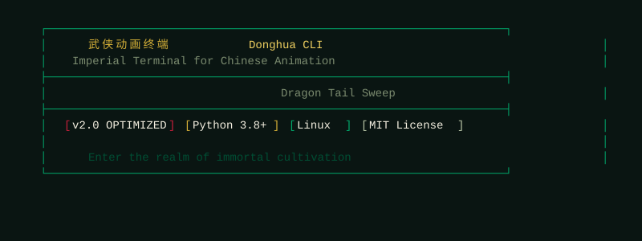
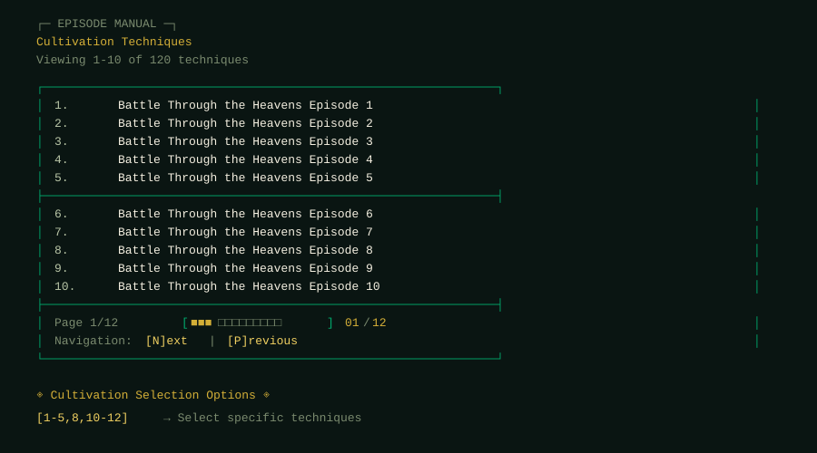
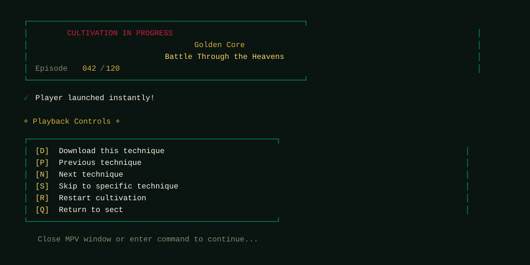

# Donghua CLI

A fast, terminal-based interface for streaming Chinese animation with intelligent caching and multi-source support.

[](https://www.python.org/downloads/)
[](LICENSE)
[](https://thanukamax.github.io/donghua-cli/)

**[📖 Full Documentation](https://thanukamax.github.io/donghua-cli/)** | **[🐛 Report Bug](../../issues)** | **[💡 Request Feature](../../issues)**

---

## Screenshots

<details>
<summary>Click to view screenshots</summary>

### Banner


### Episode Selection


### Playback Controls


</details>

---

## Quick Start

```bash
# Install dependencies
pip install requests beautifulsoup4 yt-dlp

# Run
python dhua.py "Battle Through the Heavens"
```

## Features

- **Lightning fast** - Preloads episodes while you watch, instant replay with LRU caching
- **Multi-source** - Aggregates from LuciferDonghua and AnimeXin automatically
- **Smart UI** - Clean terminal interface with proper text handling for long episode names
- **Cross-platform** - Linux, Windows, Android (Termux), iOS (iSH)
- **Offline mode** - Download episodes with parallel downloads via yt-dlp

## Installation

### Linux (Debian/Ubuntu)
```bash
sudo apt update && sudo apt install python3 python3-pip mpv ffmpeg
pip3 install requests beautifulsoup4 yt-dlp
```

### Linux (Fedora)
```bash
sudo dnf install python3 python3-pip mpv ffmpeg
pip3 install requests beautifulsoup4 yt-dlp
```

### Windows
```powershell
# Install MPV
winget install mpv

# Install Python packages
pip install requests beautifulsoup4 yt-dlp
```

### Android (Termux)
```bash
pkg install python mpv ffmpeg
pip install requests beautifulsoup4 yt-dlp
```

## Usage Examples

### Desktop (Linux/Windows)

```bash
# Interactive mode
python dhua.py

# Direct search and stream
python dhua.py "Soul Land"

# Specify source
python dhua.py "Perfect World" -s ld

# Set quality
python dhua.py "Martial Peak" -q 1080

# Download mode
python dhua.py "Tales of Demons and Gods" -d

# Show all features
python dhua.py --features

# Clear cache
python dhua.py --clear-cache
```

### Android (Termux)

The Android version (`donghua.py`) is optimized for Termux with mobile-friendly defaults (360p quality, Android intent-based player launching).

```bash
# Interactive mode - searches, picks a series, and plays
python donghua.py

# Launches video via Android intents (MPV, VLC, MX Player)
# Falls back to termux-open-url if no player is found
```

## Playback Controls

| Key | Action |
|-----|--------|
| `n` / `enter` | Next episode |
| `p` | Previous episode |
| `s` | Skip to specific episode |
| `r` | Replay current |
| `d` | Download current episode |
| `q` | Quit |

## How It Works

1. **Stream Extraction**: Fast regex pattern matching on first 8KB of HTML, BeautifulSoup fallback, yt-dlp for complex cases
2. **Caching**: LRU cache (100 entries) persists between sessions
3. **Preloading**: Background thread loads next 2 episodes while you watch
4. **Episode Detection**: Tries multiple selectors per source, auto-sorts chronologically

## Contributing

Pull requests welcome! Areas where help is appreciated:
- New source integrations
- Performance improvements
- Platform-specific fixes
- Bug reports

## Known Issues

- Some sources may be slow during peak hours
- Episode numbering can vary across sources
- Requires stable internet connection

## License

MIT License - see [LICENSE](LICENSE) for details.

## Disclaimer

This tool is for educational purposes only. Please support official releases when available. Not affiliated with any streaming sites.

---

Made by [Thanukamax](https://github.com/Thanukamax)
