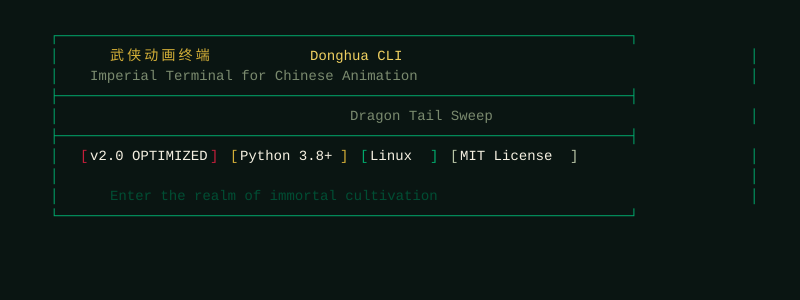
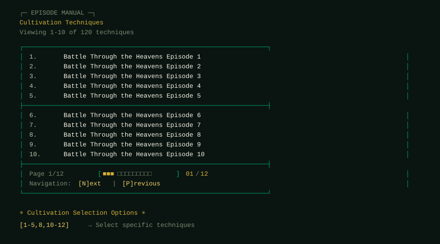
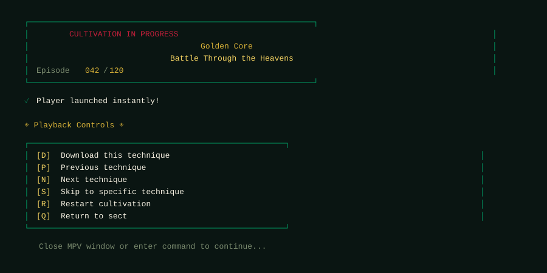

# Donghua CLI

A fast, Wuxia-themed terminal client for streaming Chinese animation with intelligent caching, preloading, and multi-source support.

[](https://www.python.org/downloads/)
[](LICENSE)
[](https://thanukamax.github.io/donghua-cli/)

**[Full Documentation](https://thanukamax.github.io/donghua-cli/)** | **[Report Bug](../../issues)** | **[Request Feature](../../issues)**

---

## Screenshots

<details>
<summary>Click to view screenshots</summary>

### Banner


### Episode Selection


### Playback Controls


</details>

---

## Quick Start

```bash
# Install (recommended)
pipx install donghua-cli

# Or with pip
pip install donghua-cli

# Run
donghua "Battle Through the Heavens"
```

## Features

- **Lightning fast** -- preloads episodes while you watch, LRU cache makes replays instant
- **Multi-source** -- aggregates from LuciferDonghua and AnimeXin
- **Rich terminal UI** -- Wuxia-themed interface built on Rich with panels, tables, and styled output
- **Cross-platform** -- Linux, Windows, macOS, Android (Termux), iOS (iSH)
- **Downloads** -- parallel episode downloads via yt-dlp

## Installation

### Prerequisites

- Python 3.9+
- [mpv](https://mpv.io/) (for playback) or VLC
- [yt-dlp](https://github.com/yt-dlp/yt-dlp) (optional, for downloads and fallback extraction)

### pipx (recommended)

```bash
pipx install donghua-cli
```

### pip

```bash
pip install donghua-cli
```

### From source

```bash
git clone https://github.com/Thanukamax/donghua-cli.git
cd donghua-cli
pip install -e .
```

### Platform-specific dependencies

<details>
<summary>Linux (Debian/Ubuntu)</summary>

```bash
sudo apt install mpv ffmpeg
```
</details>

<details>
<summary>Linux (Fedora)</summary>

```bash
sudo dnf install mpv ffmpeg
```
</details>

<details>
<summary>Windows</summary>

```powershell
winget install mpv
```
</details>

<details>
<summary>Android (Termux)</summary>

```bash
pkg install python mpv ffmpeg
```
Platform is auto-detected -- quality defaults to 360p and playback uses Android intents (MPV, VLC, MX Player).
</details>

## Usage

```bash
# Interactive mode (full TUI)
donghua

# Direct search
donghua "Soul Land"

# Specify source
donghua "Perfect World" -s ld

# Set quality
donghua "Martial Peak" -q 1080

# Download mode
donghua "Tales of Demons and Gods" -d

# Show features
donghua --features

# Clear cache
donghua --clear-cache

# The 'dhua' alias also works
dhua "Soul Land"
```

## Playback Controls

| Key | Action |
|-----|--------|
| `n` / `Enter` | Next episode |
| `p` | Previous episode |
| `s` | Skip to specific episode |
| `r` | Replay current |
| `d` | Download current episode |
| `q` | Quit |

## How It Works

1. **Stream Extraction** -- fast regex on first 8KB of HTML, BeautifulSoup fallback, yt-dlp for complex cases
2. **LRU Cache** -- 100-entry persistent cache makes repeat plays instant
3. **Preloading** -- background thread resolves the next 2 episodes while you watch
4. **Episode Detection** -- multiple CSS selectors per source, auto-sorted chronologically

## Project Structure

```
donghua-cli/
  src/donghua_cli/    # Main package
    cli.py            # Entry point + arg parsing
    app.py            # Application logic
    ui.py             # User interaction flows
    theme.py          # Rich-based Wuxia theme
    scraper.py        # Source scrapers
    extractor.py      # Stream URL extraction
    player.py         # MPV/VLC/Android player
    cache.py          # LRU cache + preloader
    config.py         # Platform detection + settings
    utils.py          # Shared utilities
  docs/               # GitHub Pages site + assets
  scripts/            # Install helpers
  pyproject.toml      # Package config (hatchling)
```

## Contributing

Pull requests welcome! See [docs/future_ideas.md](docs/future_ideas.md) for the roadmap.

## License

MIT License -- see [LICENSE](LICENSE) for details.

## Disclaimer

This tool is for educational purposes only. Please support official releases when available. Not affiliated with any streaming sites.

---

Made by [Thanukamax](https://github.com/Thanukamax)
